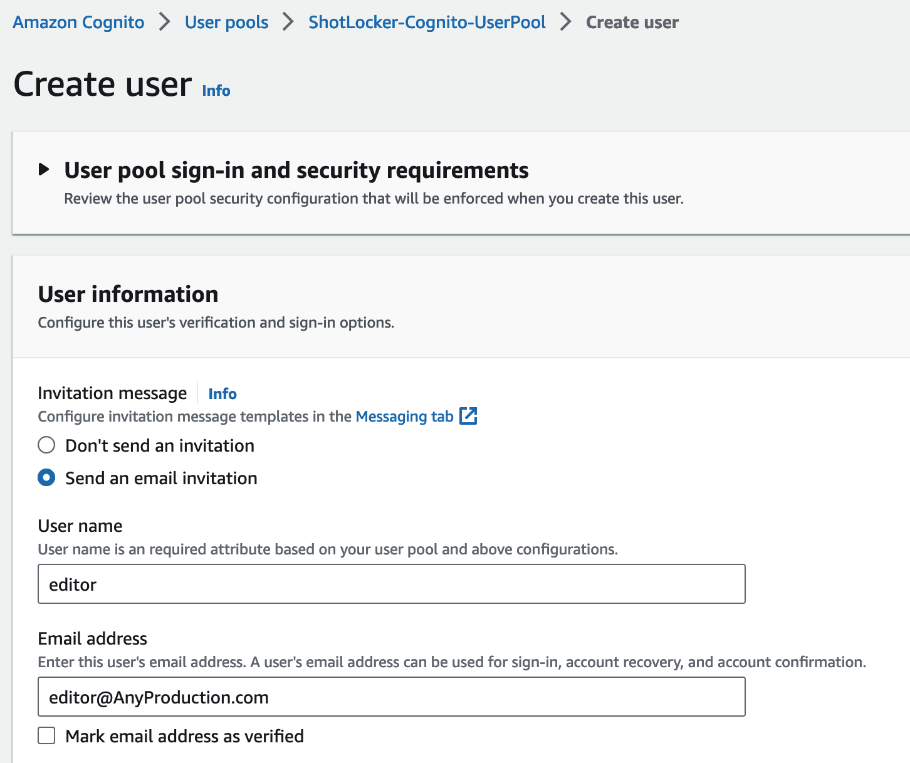

# Managing Media Access in a Content Lake

The Shot Locker Project demonstrates how feature film or TV episodic Editorial Cut can be used as organizing Cloud permissions access for third party personnel such as VFX Vendors to the production media. This mechanism is a small but critical part of the Content Lake Cloud solution. As Hollywood Studios move production into the cloud, adoption will be driven by solutions that integrate into well-established industry workflows without adding any additional technical burden.

A Content Lake is a prescriptive method for aggregating Original Camera Negative, audio, and metadata from onset production into [Amazon S3](https://aws.amazon.com/s3/). Using a well-defined file structure in S3 enables workflows and pipelines to be designed and operate in an productive and efficient way.

Shot Locker easily integrates with current production workflows. A VFX editor uses the edit for project management of plate distribution to VFX vendors and for the approval of shots. The VFX editor will upload the edit to the Content Lake service running in your AWS account. All of the production media referenced in the edit will then be identified and tagged. The VFX editor that uploaded the edit can then easily grant access to all of the associated production media to users or roles in the VFX vendor AWS accounts. The VFX vendor will have access only to production media identified in the edit and not the entire Content Lake. This limited access adheres to the MovieLabs 2030 principle of keeping a single master copy of production media for IP security purposes and control. Granting access is done by writing the Amazon S3 Bucket policy to give permission to the User only for the assets tagged with the unique identifier.

## Design

Shot Locker is designed using an AWS Serverless architecture. Serverless Architecture is an approach to build and run applications and services without having to manage the infrastructure yourself. This takes advantage of serverless solutions which are highly-available, secure, high-performant and resilient.

Serverless combines a few different architectures — loosely coupling, microservices, and event-driven architectures. Where you breakdown the application into small pieces where each piece does one thing really well. Key component is that resource consumption is only when these services are being used and for short durations. You are not paying for a server to be running 24-7 just sitting there.

### Architecture Design

Here is Shot Lockers architecture design. The key aspects are:

* Website is hosted in an [Amazon S3](https://aws.amazon.com/s3/) bucket using Cloudfront as the CDN.
* [Amazon Cognito](https://aws.amazon.com/cognito/) is an identity stored used to manage user authentication.
* [AWS API Gateway](https://aws.amazon.com/api-gateway/) is used to manage the ReST-ful API. The API itself is running in a lambda. Endpoint access verified using API Gateway Cognito Authorizer.
* [Amazon Cloudfront](https://aws.amazon.com/cloudfront) redirects all requests to the API endpoint to the API Gateway.
* When an editorial file is uploaded, it is written to the Amazon S3 Content Lake. This triggers the processing of the edit as explained next.
* Any [AWS IAM](https://aws.amazon.com/iam) user or role granted permission modifies the Amazon S3 Bucket Policy to allow access with an expiry date.
* Edit logs implemented with [Amazon Cloud Watch](https://aws.amazon.com/cloudwatch/) Logs.

<p align="center">
  
</p>

When an editorial file is uploaded, it is uploaded to the Content Lake in the ShotLocker/Edits/{Unique_Identifier}/ prefix (folder). This triggers an event that starts the processing of an edit using AWS Step Function Workflow Orchestration.

<p align="center">
  
</p>

The steps are as follows:
1. The Editorial file is validated.
2. The Editorial file is converted to an OpenTimeline IO manifest file. It is incomplete at this point.
3. The edit is conformed with the existing production assets. All of the production assets in the edit are identified and the Amazon S3 AWS ARN replaces the OpenTimeline IO media source.
4. All of the identified production assets are tagged with the unique identifier.

Once generated, the manifest is placed in the same prefix as the original uploaded editorial file. The manifest file is tagged with the take unique identifier so it can be made available to any IAM user or role that has been granted access.

### Permissions 

When an edit is uploaded to Shot Locker, a unique 10 alpha-numeric identifier is generated. Each production asset identified in the edit will have the unique identifier added as part of a S3 Object tag on the asset. The tag key is *ShotLockerAccess* and the value will be set with the unique identifer. Multiple unique identifiers can be assigned to a single object by using a ':' as a separator for the key value. Currently, S3 Object Tag values have a size limit of 255 characters making the object can only be referenced by 23 different unique identifiers.

Access is granted or revoked for an AWS IAM user or role access by modifying the Content Lake S3 Bucket Policy. Bucket policies are JSON documents that grant or deny access to S3 objects based on a number of criteria. For Shot Locker, access is granted for the certain IAM user or role on the condition that the S3 Object has the *ShotLockerAccess* tag set with the unique identifier. 

Here is an example of an Amazon S3 Bucket Policy when access is granted to an edit identified by a unique identifer (t7ory5o5hm).

```
{
    "Version": "2012-10-17",
    "Statement": [
        {
            "Sid": "ShotLockerta1b2c3d4567890abcdef",
            "Effect": "Allow",
            "Principal": {
                "AWS": "arn:aws:iam::111122223333:user/anyuser"
            },
            "Action": "s3:GetObject",
            "Resource": "arn:aws:s3:::DOC-EXAMPLE-BUCKET/*",
            'Condition': {  
                "StringLike": { 
                    "s3:ExistingObjectTag/ShotLockerAccess": "*1234567890*" 
                }, 
                "DateLessThan": { 
                    "aws:CurrentTime": "2025-06-15T23:59:59Z" 
                } 
            }
        }
    ]    
}
```

When access is revoked, the Bucket Policy is updated and the IAM user or role is removed from the production asset allow policy.

S3 Bucket Policies are used instead of alernatives because it allows for all of the Shot Locker access control to be in a single location. Plus, S3 Bucket Policies is the best way to grant access to third-party IAM users or roles.

S3 Object Tags are used because tags can be used as part of the Bucket Policy permission system.

It is recommended for any Amazon S3 bucket that will be used for production media is set to block all public access and all access is logged. Make sure to have the appropriate lifecycle rules set for objects in the bucket.

## Installation

ShotLocker is deployed using the AWS Cloud Development Kit (AWS CDK) which defines the cloud infrastructure as code

### Requirements

Before deploying, the following elements are required :

 * [An AWS Account](https://docs.aws.amazon.com/accounts/latest/reference/manage-acct-creating.html).
 * [AWS CLI](https://docs.aws.amazon.com/cli/latest/userguide/cli-chap-configure.html) installed and configured.
 * [Node](https://nodejs.org) v18.17.0 or greater installed.
 * [AWS Cloud Development Kit](https://aws.amazon.com/cdk/) version 2.90 or greater installed.
 * [Python](https://docs.aws.amazon.com/cdk/v2/guide/work-with-cdk-python.html) v3.7 or greater installed (needed by AWS CDK).
 * [Docker Desktop](https://www.docker.com/products/docker-desktop/) v4.19 or greater installed.

If deploying using the Mac with an M1+ ARM based processor, please refer to Appendix A for details with handling cross architecture lambda layer build.

### Frontend

The front end web GUI is built using React and the [Cloud Designs](https://cloudscape.design/) widget set. It has a similar design feel as the AWS console.

#### Build

Starting at the top level of the repo.

```
cd frontend
npm install
npm run build
cd ..
```

Builds the app for production to the `build` folder. It correctly bundles React in production mode and optimizes the build for the best performance. The build is minified and the filenames include the hashes.


### Backend

This project is set up like a standard Python project. The initialization process also creates
a virtualenv within this project, stored under the .venv directory. To create the virtualenv
it assumes that there is a `python3` executable in your path with access to the `venv` package.
If for any reason the automatic creation of the virtualenv fails, you can create the virtualenv
manually once the init process completes.

You should be at the top level of the repo.

To manually create a virtualenv on MacOS and Linux:

```
$ python3 -m venv .venv
```

After the init process completes and the virtualenv is created, you can use the following
step to activate your virtualenv.

```
$ source .venv/bin/activate
```

If you are a Windows platform, you would activate the virtualenv like this:

```
% .venv\Scripts\activate.bat
```

Once the virtualenv is activated, you can install the required dependencies.

```
$ python3 -m pip install -r requirements.txt
```

The ```cdk.context.json``` needs to be edited and the ```prod.postfix``` field needs to be set. It will required to be globally unique (Amazon Cognito requires globally unique user pools). If the field is not unique, the installation process will stop and you will be able to run install again. 

Next, make sure docker is running.

At this point you can deploy the CloudFormation generated template using CDK for this project. 

```
$ cdk deploy
```

#### Outputs

Once the CDK has been deployed, there will be a number of useful outputs. Of particular use is the ShotLocker-Stack.ShotLockerCloudFrontURL. This is the URL that be used to log into Shot Locker once a user has been created.

```
Outputs:
ShotLocker-Stack.ShotLockerAPIGatewayEndpoint396421C2 = https://abcdef0123.execute-api.us-east-1.amazonaws.com/prod/
ShotLocker-Stack.ShotLockerAPIGatewayURL = https://abcdef0123.execute-api.us-east-1.amazonaws.com/prod/
ShotLocker-Stack.ShotLockerAccessLogBucketName = shotlocker-stack-shotlockeraccesslogbucketabcdef-0123456
ShotLocker-Stack.ShotLockerCloudFront-URL = https://a1b2c3d45678ef.cloudfront.net
ShotLocker-Stack.ShotLockerCloudFront-DomainName = a1b2c3d45678ef.cloudfront.net
ShotLocker-Stack.ShotLockerCognitoClientId = a1b2c3d4567890abcdefa1b2c3
ShotLocker-Stack.ShotLockerCognitoUserPoolId = us-east-1_abcdef0123
ShotLocker-Stack.ShotLockerLogGroupName = ShotLocker-Stack-ShotLockerLogGroupabcdef-0123456
ShotLocker-Stack.ShotLockerWebsiteBucketName = shotlocker-stack-shotlockerfrontendbucketabcdef-0123456
```

This information is also available in the AWS Console in the CloudFormation Service Panel.

<p align="center">
  
</p>


### Cross Origin Resource Sharing

Shot Locker lambda limits CORS origin requests just from the Amazon Cloudfront CDN. If you wish to allow other domains, set the enviroment variable ```CORS_ALLOW_ORIGINS_LIST``` on the the AWS lambda ```ShotLocker-API-Gateway-ReST``` to a comma delimited list of domains.

## Usage

### Creating Users

Shot Locker leverages Amazon Cognito for user authentication. Below are the visual steps for adding a new user account.

<p align="center">
  
</p>

<p align="center">
  
</p>

<p align="center">
  
</p>


## Removal

The quickest way to uninstall Shotlocker from an AWS account is to Delete the Shotlocker Stack in the AWS Console CloudFormation Services page. First navigate to the AWS CloudFormation Services page, select the Shotlocker Stack and then Delete it. This will delete all of the resources created during the CDK deployment. This will not remove any user permissions from the Amazon S3 Buckets or any content generated by ShotLocker including OpenTimelineIO manifest files. This also will not automatically remove any logs generated by the AWS services in Amazon CloudWatch or stored in Amazon S3. To remove the access logs, the access log S3 bucket can be identified by looking at the ```ShotLocker-Stack.ShotLockerAccessLogBucketName``` CloudFormation output value and removing the contents. The output value ```ShotLocker-Stack.ShotLockerLogGroupName``` identifies the CloudWatch Log Group which can be delete as well as any Groups that begin with ```/aws/lambda/ShotLocker```.

<p align="center">
  
</p>


## AWS Services

Here is a list of AWS services used by this example.

* [Amazon S3](https://aws.amazon.com/s3/) access to read existing content and write uploaded edits and processed results. Website is stored in S3 bucket.
* [Amazon API Gateway](https://aws.amazon.com/api-gateway/) for all ReST endpoints and authorizing access via [Amazon Cognito](https://aws.amazon.com/cognito/).
* [AWS Lambda](https://aws.amazon.com/lambda/) is used by the API Gateway, Step Functions, and S3 Uploads.
* [AWS Step Functions](https://aws.amazon.com/step-functions/) for any processing and enable / disable actions.
* [Amazon Cognito](https://aws.amazon.com/cognito/) for user credentials.
* [Amazon CloudFront](https://aws.amazon.com/cloudfront/) for CDN access to the ShotLocker UI.
* [Amazon CloudWatch](https://aws.amazon.com/cloudwatch/) Logs for all service logging.
* [AWS CloudFormation](https://aws.amazon.com/cloudformation/) (using [AWS CDK](https://aws.amazon.com/cdk/)) for installation and removal.

## Picchu Example

The [AWS Picchu Edit](https://dpel.aswf.io/aws-picchu-edit/), an unrefined edit containing all layers, will serve as our test footage for Shot Locker instead of a trimmed and finalized video.

### Steps

**Note: this may incur AWS charges.**

1. Install ShotLocker into an AWS account.
2. Download the two highlighted AWS Picchu Edit files from the [AWS Picchu Edit Download URL](https://dpel.aswf.io/aws-picchu-edit/).
<p align="center">
  
</p>

3. Upload the entire unzipped Resolve Project to a new Amazon S3 bucket in the AWS account.
   * _Strong Recommendation to block all public access for this bucket_
4. Create a user in Shotlocker Cognito User Pool (_See Below_).
5. Log into ShotLocker.
   * use the URL assigned during the CDK install process (see CloudFormation Output ShotLockerCloudFrontURL).
6. Mark the newly created Amazon S3 bucket as a Shot Locker bucket.
<p align="center">
  
</p>

7. Select the newly created Shot Locker in the list.
8. Press *Upload Edit* button and choose the downloaded `aws-picchu-edit.otio` file. 

This will bring you to the Edit Summary page where you can see the current status, logs, and control access. Once the process is completed and successful, the manifest will be available. This manifest is an OpenTimelineIO edit file with all of the media linked pointing to an S3 URL in the Content Lake Shot Locker bucket.

## Future Potential

 * Upload extended to include sidecar files such as photos, script notes, etc.
 * The Amazon S3 object tagging runs in a lambda which has a 15 minute maximum execution time. This may need to be optimized to handle larger edits that will take longer than 15 minutes. Using a threadpool or subprocesses can have the tagging done in parallel.
 * Amazon S3 object tagging is limited by the total number of tags along with the length of each tag. This approach will hit this limit and will need to be modified. Current limit is that each unique identifier requires 10 characters with one delimiter. With a 255 character maximum limit on tag values and ShotLocker only using one tag, the maximum number of edits that tag the same object is 23.
 * Robust error handling. There are a number of corner cases that will "fall" through the cracks in this demo example. Here are a list of a few:
   * Conform all the clips in an edit and some of the original material is not found.
 * Monitoring Amazon S3 usage.
 * Amazon S3 Bucket Policies are modified by multiple lambdas in the system. There currently isn't any protection in place to prevent multiple updates to the Bucket Policy at the same time. There is a small but possible window for some overlapping of updates to the Bucket Policy may in fact has lost grant or revoking of permissions. To address this potential issue in the future, a mutex lock control would be needed to grant updates to the Bucket Policy. There are a number of different services in AWS that can be used for mutex locks.
 * Extend conform to handle proxy videos for individual frame identification.
 * Connect to existing Cognito User Pools instead of creating a new one.
 

## Notice

Sample code, software libraries, command line tools, proofs of concept, templates, or other related technology are provided as AWS Content or Third-Party Content under the AWS Customer Agreement, or the relevant written agreement between you and AWS (whichever applies). You should not use this AWS Content or Third-Party Content in your production accounts, or on production or other critical data. You are responsible for testing, securing, and optimizing the AWS Content or Third-Party Content, such as sample code, as appropriate for production grade use based on your specific quality control practices and standards. Deploying AWS Content or Third-Party Content may incur AWS charges for creating or using AWS chargeable resources, such as running Amazon EC2 instances or using Amazon S3 storage. 


## Appendix A: Apple Mac M1+

If deploying using the Mac with an M1+ ARM based processor, this project will build the lambda layers for the x64/AMD64 architecture. Here are the additional steps on the Mac to build:

In Docker Desktop settings, make sure that the Beta feature "Use Rosetta for x86/amd64 emulation on Apple Silicon" is turned on. This feature may no longer be in beta in future versions of Mac Docker Desktop.

Mac installation for Docker requires installing Rosetta 2.

https://docs.docker.com/desktop/install/mac-install/#system-requirements

```
 softwareupdate --install-rosetta
```

Before running any CDK commands, make sure to set the following environment variables in the shell.

```
export DOCKER_DEFAULT_PLATFORM='linux/amd64'
export DOCKER_BUILDKIT=1
```

Before proceeding, it is advisable to remove any previously downloaded Python images from Docker. This step ensures that the latest Python x64/AMD64 image is downloaded and utilized for the installation process. Using the ARM Python image may lead to the creation of a Lambda Layer that is incompatible with the installation, resulting in errors and preventing the website from functioning correctly.

There are a few ways to check that you built with x64/AMD64 architecture. First is to look at the Docker output and check the architecture for the Python whls installed. You will see the x86_64 in the whl name instead of aarch64.

```
Collecting opentimelineio==0.15.0
  Downloading OpenTimelineIO-0.15.0-cp39-cp39-manylinux_2_12_x86_64.manylinux2010_x86_64.whl (846 kB)
```

Another way is to check in the Docker dashboard. Make sure the Python image is marked as AMD64.

<p align="center">
  
</p>

If there is a problem during installation because of an Python ARM image, the website will have an alert message appear.

<p align="center">
  
</p>